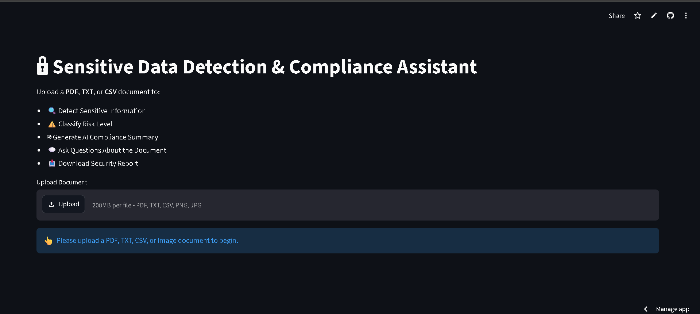
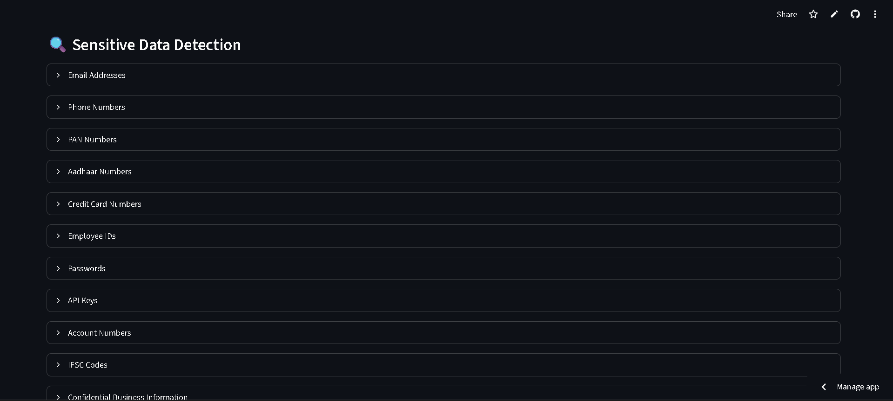
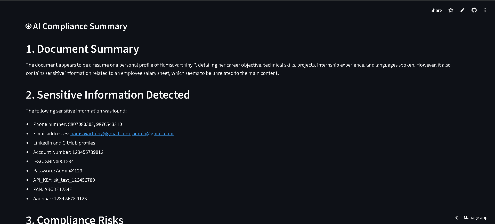
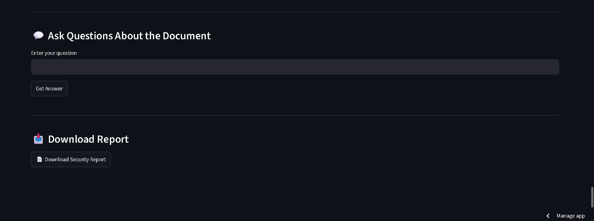
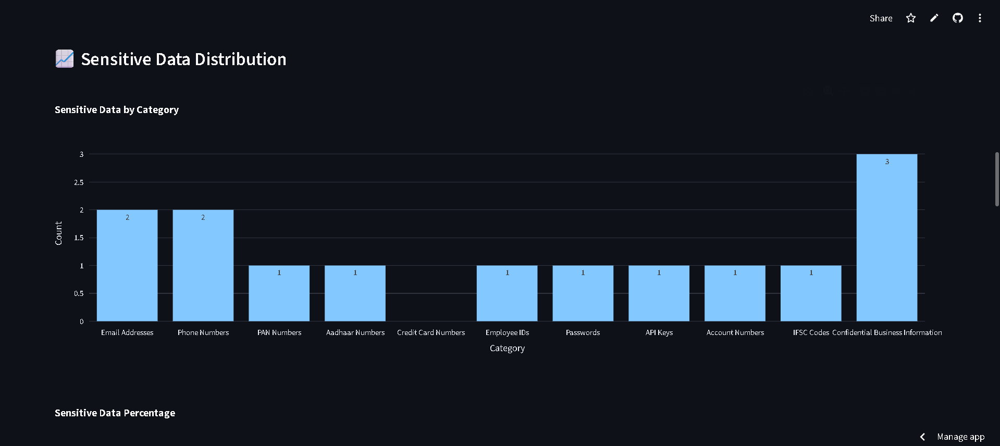

# 🔒 AI-Based Sensitive Data Detection & Compliance Assistant

An AI-powered document security application that detects sensitive information, classifies document risk, generates AI-powered compliance summaries, and enables intelligent document question answering using Retrieval-Augmented Generation (RAG).

---

# 📌 One-Line Description

An AI-powered document security system that detects sensitive information, classifies compliance risks, generates AI summaries, and answers document-based questions using RAG.

---

# 📖 Project Overview

Organizations frequently work with confidential documents containing Personally Identifiable Information (PII), financial records, passwords, API keys, employee details, and confidential business information.

Manually identifying sensitive information is time-consuming and error-prone.

This project automatically analyzes uploaded documents, detects sensitive information, classifies document risk, generates compliance summaries using Large Language Models (LLMs), and provides an intelligent chatbot that answers questions strictly from the uploaded document.

The application supports multiple document formats, OCR for scanned documents, automatic data masking, interactive dashboards, and downloadable security reports.

---

# 🚀 Features

## 📂 Document Upload

Supports multiple document formats:

- PDF
- TXT
- CSV
- PNG
- JPG / JPEG

---

## 📄 Intelligent Text Extraction

Supports:

- Text-based PDFs
- Scanned PDFs
- Images
- TXT Files
- CSV Files

OCR is automatically used when scanned documents are detected.

---

## 🔍 Sensitive Data Detection

Automatically detects:

- Email Addresses
- Phone Numbers
- Aadhaar Numbers
- PAN Numbers
- Employee IDs
- Bank Account Numbers
- IFSC Codes
- API Keys
- Passwords
- Credit Card Numbers
- Confidential Business Information

---

## 🔒 Automatic Data Masking

Sensitive information is automatically masked before displaying extracted text.

Example:

Original

```
john@gmail.com
```

Masked

```
j*******@gmail.com
```

---

## 📄 OCR Support

Supports scanned documents using:

- Tesseract OCR
- OpenCV Image Preprocessing
- PDF2Image (Poppler)

This enables text extraction even from scanned PDFs and images.

---

## ⚠️ Risk Classification

Each uploaded document receives a security risk level.

Risk Levels:

- 🟢 LOW
- 🟡 MEDIUM
- 🔴 HIGH

Risk is calculated using weighted scoring based on detected sensitive information.

---

## 📊 Interactive Dashboard

Displays:

- Total Sensitive Items
- Risk Score
- Risk Level
- Bar Chart
- Pie Chart
- Risk Score Breakdown

---

## 🤖 AI Compliance Summary

Using Groq LLM, the application automatically generates:

- Document Summary
- Sensitive Information Found
- Compliance Risks
- Security Risks
- Recommended Security Improvements

---

## 💬 AI Document Chatbot (RAG)

Users can ask natural language questions about the uploaded document.

Examples:

- What technical skills are mentioned?
- How many API keys exist?
- Summarize the internship experience.
- Does this document contain confidential information?

The chatbot answers **only using the uploaded document**.

---

## 📥 Security Report Generation

Generates a downloadable report containing:

- Sensitive Data Summary
- Risk Classification
- AI Compliance Summary

---

# 🛠️ Technologies Used

## Frontend

- Streamlit

## Backend

- Python

## Artificial Intelligence

- Groq LLM
- Retrieval-Augmented Generation (RAG)

## OCR

- Tesseract OCR
- OpenCV
- pdf2image
- Pillow

## Information Retrieval

- TF-IDF Vectorizer
- Cosine Similarity

## Data Processing

- Pandas
- Regular Expressions (Regex)

## Visualization

- Plotly

---

# 🏗️ Architecture Overview

The application follows a modular document processing pipeline.

```
                Upload Document
                        │
                        ▼
              Text Extraction Module
       (PDF / TXT / CSV / OCR Images)
                        │
                        ▼
         Sensitive Data Detection Engine
                        │
                        ▼
            Risk Classification Module
                        │
          ┌─────────────┴─────────────┐
          ▼                           ▼
 AI Compliance Summary          RAG Chatbot
          │                           │
          └─────────────┬─────────────┘
                        ▼
               Interactive Dashboard
                        │
                        ▼
               Download Security Report
```

---

# 🤖 AI / ML Approach

This project combines OCR, NLP, Information Retrieval, and Large Language Models.

## 1. OCR

Scanned documents are processed using:

- Tesseract OCR
- OpenCV preprocessing

This enables extraction of text from scanned PDFs and images.

---

## 2. Sensitive Data Detection

The system uses optimized Regular Expressions (Regex) and rule-based detection for identifying:

- Email Addresses
- Phone Numbers
- Aadhaar Numbers
- PAN Numbers
- Employee IDs
- API Keys
- Passwords
- Account Numbers
- IFSC Codes
- Confidential Business Information

---

## 3. Risk Classification

Each detected category contributes a weighted score.

The cumulative score determines:

- LOW
- MEDIUM
- HIGH

risk level.

---

## 4. AI Compliance Summary

The extracted document is sent to the Groq LLM which generates:

- Document Summary
- Compliance Risks
- Security Risks
- Recommendations

---

## 5. Retrieval-Augmented Generation (RAG)

Instead of sending the entire document to the LLM:

- Document is split into chunks.
- TF-IDF creates document vectors.
- Cosine Similarity retrieves relevant chunks.
- Only relevant chunks are sent to the LLM.

Advantages:

- Faster responses
- Lower API token usage
- Better accuracy
- Reduced hallucinations

---

# 📂 Project Structure

```
SensitiveDataDetector/

│── app.py
│── parser.py
│── detector.py
│── classifier.py
│── summarizer.py
│── chatbot.py
│── rag_engine.py
│── report_generator.py
│── requirements.txt
│── README.md
│── .gitignore
│── upload/
```

---

# ⚙️ Installation

## Clone Repository

```bash
git clone https://github.com/Hamsa1016/Sensitive-Data-Detector.git
```

Move into project folder

```bash
cd Sensitive-Data-Detector
```

Create virtual environment

```bash
python -m venv venv
```

Activate virtual environment

Windows

```bash
venv\Scripts\activate
```

Install dependencies

```bash
pip install -r requirements.txt
```

Run application

```bash
streamlit run app.py
```

---

# 🔑 Environment Variables

Create a `.env` file.

Example:

```
GROQ_API_KEY=your_groq_api_key
```

---

# ▶️ Usage

1. Upload a document.
2. Extract document text.
3. Detect sensitive information.
4. Review masked content.
5. View dashboard and risk score.
6. Generate AI compliance summary.
7. Ask questions using the AI chatbot.
8. Download the generated security report.

---

# ⚠️ Challenges Faced

## OCR Accuracy

Scanned documents produced noisy text.

**Solution**

- Image preprocessing
- Thresholding
- OCR cleaning
- Regex corrections

---

## API Token Limits

Groq API has daily token limits.

**Solution**

- TF-IDF based Retrieval-Augmented Generation
- Reduced prompt size
- Exception handling

---

## Large Documents

Sending entire documents to the LLM consumed many tokens.

**Solution**

Implemented TF-IDF RAG to retrieve only relevant document chunks.

---

## Multiple File Formats

Supporting PDF, TXT, CSV, Images, and Scanned PDFs required different extraction pipelines.

**Solution**

Built a unified parser with OCR fallback.

---

## Data Privacy

Sensitive information should never be exposed directly.

**Solution**

Implemented automatic masking before displaying extracted text.

---

## Performance Optimization

Repeated indexing increased processing time.

**Solution**

Stored the RAG index in Streamlit Session State and rebuilt only when a new document is uploaded.

---

# 🔮 Future Improvements

- FAISS Vector Database
- Sentence Transformer Embeddings
- Hybrid Search (TF-IDF + Embeddings)
- SQLite Audit Logging
- User Authentication
- Multi-user Support
- Role-Based Access Control (RBAC)
- Docker Deployment
- Cloud Deployment
- Admin Dashboard
- Compliance Score Meter
- Support for DOCX and Excel Files
- Automatic PII Redaction
- Multi-language OCR
- Offline Local LLM Support
- Dark Mode

---

# 📸 Sample Output

The application provides:

- Extracted Document Text
- Sensitive Data Detection
- Risk Dashboard
- AI Compliance Summary
- AI Document Chatbot
- Downloadable Security Report

# 📸 Screenshots

## Home Page



## Sensitive Data Detection



## AI Compliance Summary



## AI Document Chatbot



## AI Risk Classification


## AI Sensitive Data Distribution



# 🎯 Use Cases

- Enterprise Document Security
- HR Document Screening
- Financial Document Review
- Healthcare Record Protection
- Compliance Auditing
- Government Record Analysis
- Privacy Risk Assessment

---

# 👩‍💻 Developer

**Hamsavarthiny P**

Aspiring Software & Full Stack Developer

GitHub

https://github.com/Hamsa1016

LinkedIn

https://linkedin.com/in/hamsavarthiny

---

# 📄 License

This project is developed for educational, research, and demonstration purposes.

---

# 🙏 Acknowledgements

Special thanks to the open-source community and the following technologies:

- Streamlit
- Groq
- Plotly
- OpenCV
- Tesseract OCR
- pdf2image
- Pandas
- Pillow
- Python